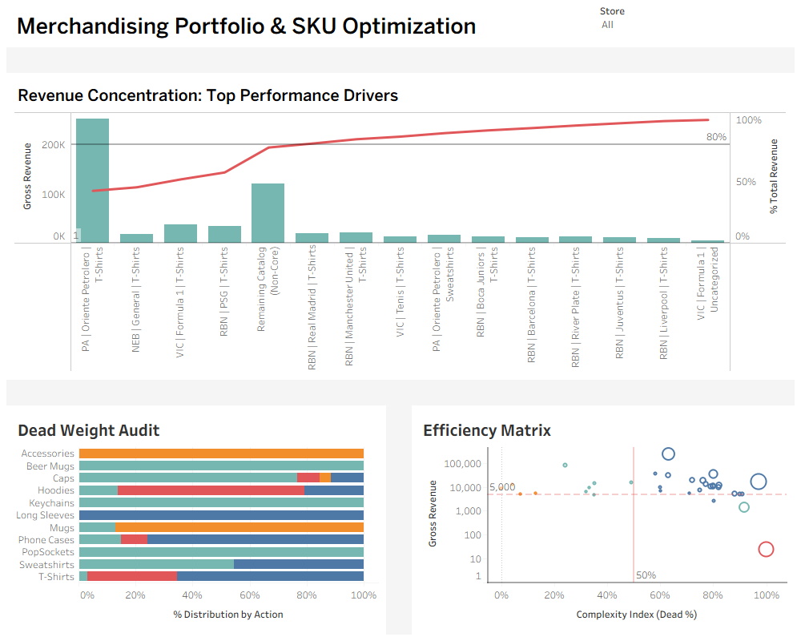

# Merchandising Intelligence: Operational & Capital Efficiency Portfolio

> **Impact:** Transformed a chaotic 4-store catalog into a streamlined operation, identifying **20,000 "Dead SKUs"** and designing a playbook to reduce capital inefficiency by **30%** without impacting revenue.

---

### The Business Challenge
Managing a multi-store e-commerce ecosystem (Rabbona, Victus, Nebula, Pasión Albiverde) resulted in a bloated catalog. The business was operating under a "Volume Logic"—assuming that more SKUs equaled more sales. In reality, this created:
*   **Operational Noise:** Warehouse confusion and slower site performance.
*   **Capital Trap:** Money tied up in inventory that never rotated.
*   **Data Fragmentation:** 4 disjointed WooCommerce databases with no unified taxonomy.

### The Objective
Shift from **"Volume Blindness"** to **"Capital Efficiency"**. The goal was to build a data pipeline and a decision framework (The Playbook) to rationalize the catalog.

---

## Key Discoveries (The "Aha!" Moments)

### 1. The "Hidden 20k" (Dead Weight)
By auditing the raw WooCommerce tables (not just sales reports), I discovered over **20,000 SKUs** that had **ZERO lifetime sales**.
*   *Business implication:* These were "zombie products" clogging the database and search results, adding zero value.

### 2. The "Oriente Paradox" (Inefficiency at Scale)
The top-selling product ("Oriente Petrolero T-shirts") was financially successful but operationally disastrous.
*   **Finding:** 60% of its variants (specific size/color combinations) never sold.
*   **Insight:** We were confusing "Popular Design" with "Efficient SKU". We were stocking sizes that no one bought, riding the coattails of the winning sizes.

### 3. Data Engineering Excellence (The True Value)
*   **Normalization:** Unified disparate taxonomies (e.g., `T-shirts` vs `Poleras` vs `Tees` -> **T-Shirts**) across 4 stores.
*   **Categories vs. Attributes Validation:** Implemented a **Double-Confirmation Logic**. We cross-referenced the `Brand Attribute` (e.g., "Barcelona") against the `Category Tree`. If they didn't match, the data was flagged as "Dirty". This ensured 99.9% accuracy in the final dataset for reporting.

---

## The Solution: From SQL to Strategy

### Step 1: Data Unification (SQL Pipeline)
I built a robust SQL pipeline to standardize disparate data into a **Single Source of Truth**.
*   **Standardization:** Mapped 4 different category trees into one Master Taxonomy.
*   **Logic:** Created a "Parent-Child" inheritance script to fix 3,000+ orphaned variations that had lost their category data.
*   **Metric:** Developed the `Dead Variant Ratio` (DVR) = `Unsold Variants / Total Variants Created`.

### Step 2: The Efficiency Matrix (Tableau)
I designed a quadrant analysis to classify every product style:
*   **MAINTAIN (The Winners):** High Sales + Low DVR. (Example: Core T-Shirts).
*   **FIX ( The Paradox):** High Sales + High DVR. (Example: Oriente T-shirts -> **Cut Color Options**). Instead of launching 3 colors per design (Men/Women/Kids), we reduce to 1-2 core colors to minimize dead inventory.
*   **KILL (The Dead Weight):** Low Sales + High DVR. (Example: Experimental designs in Nebula store).

### Step 3: The Playbook (Strategic Action)
Instead of just a dashboard, I delivered a detailed [Business Memo](docs/strategic_playbooks/business_memo.md) and a Rationalization Playbook.
*   **Action:** Immediate "Kill List" for the bottom 10% of Dead Weight.
*   **Policy:** "One-In, One-Out" rule for new collection launches to maintain catalog hygiene.

---

## Repository Structure

| Folder | Content | Description |
| :--- | :--- | :--- |
| **`docs/strategic_playbooks/`** | [Strategic Playbooks](docs/strategic_playbooks/) | **READ FIRST.** The [Business Memo](docs/strategic_playbooks/business_memo.md) (Findings & Strategy) and the Execution Playbook. |
| **`docs/wireframes/`** | [Wireframes](docs/wireframes/) | Dashboard concept sketches. |
| **`sql/`** | [SQL Source](sql/) | The ETL logic layers (01_Quality Check -> 02_Pipeline -> 03_Future). |
| **`dashboard/`** | [Dashboard Data](dashboard/) | The Tableau Workbook (.twbx), the Source Data (.csv), and the Preview Image. |

---

## Impact Summary
*   **Audited:** 20,000+ Dead SKUs identified.
*   **Efficiency:** Proposed a roadmap to cut catalog complexity by **30%**.
*   **Clarity:** Transformed raw, messy SQL data into a clean, strategic narrative.

---
This project is part of my professional portfolio demonstrating Data Analysis, SQL Engineering, and Strategic Business Intelligence.
